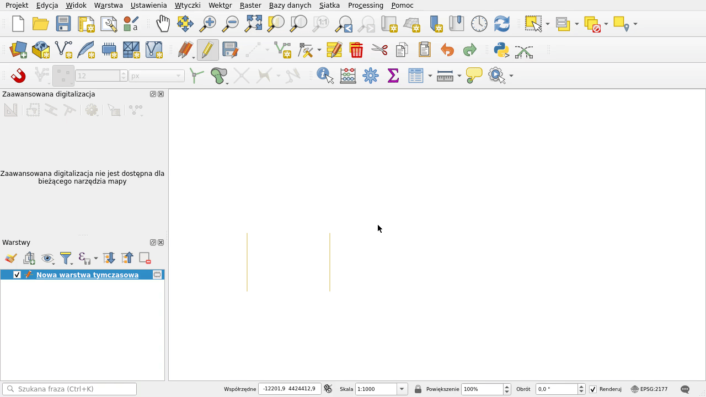

PRZECIĘCIE DWÓCH ODLEGŁOŚCI - WTYCZKA DLA APLIKACJI QGIS

Wtyczka umożliwa uzyskanie przecięcia dwóch odległości (w kartezjańskim układzie 2D). Uruchomiono w następujących wersjach QGIS: 3.34.7, 3.34.11, 3.34.13, 3.40.02.

Uwaga: Od QGIS 3.40 panel zaawansowanej digitalizacji posiada nowe meni przycisk 2-Circle Point Intersection i instalacja wtyczki nie jest konieczna.

Wersja 1.0.18

